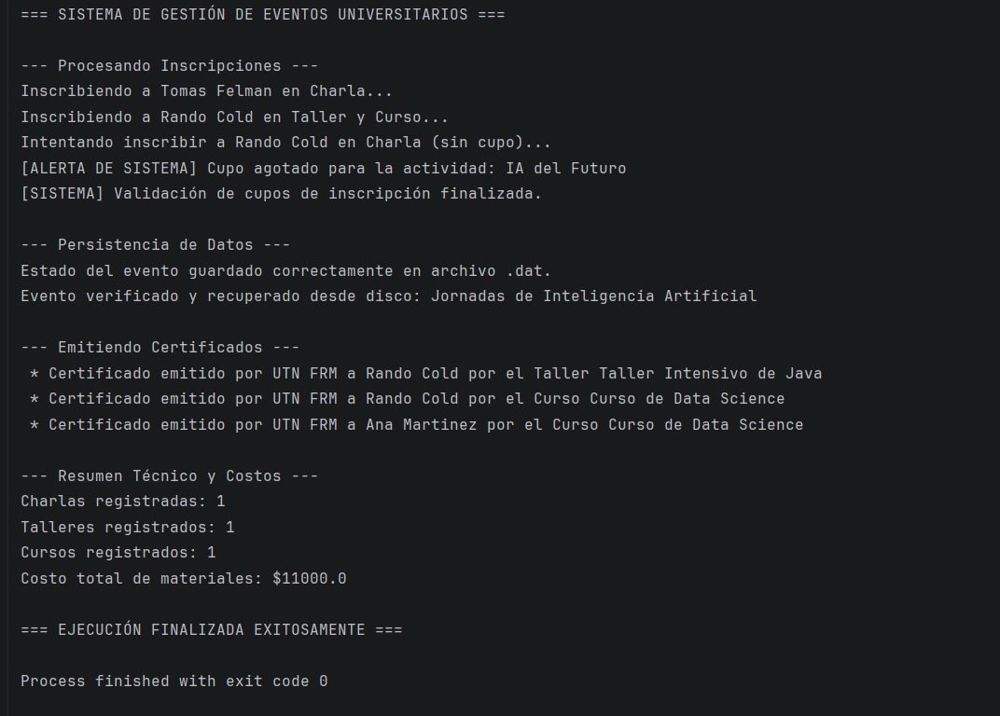

# PP_TP2_53350 - Trabajo Práctico N° 2

## Información del Alumno
* **Nombre:** Tomas Felman
* **Legajo:** 53350
* **Carrera:** Ingeniería en Sistemas de Información (UTN FRM)
* **Asignatura:** Paradigmas de Programación - 2026

## Descripción del Proyecto
Sistema de Gestión de Eventos Universitarios desarrollado en Java con arquitectura modular, manejo de excepciones, persistencia de datos mediante serialización y uso de genéricos.

## Descarga desde IntelliJ IDEA
1. Copia la URL del repositorio: `https://github.com/Naps2007/PP_TP2_53350.git`
2. Abre **IntelliJ IDEA**.
3. En la pantalla de bienvenida o menú superior, ve a **File > New > Project from Version Control...** (o haz clic en **Get from VCS**).
4. Pega la URL en el campo **URL** y presiona **Clone**.
5. Selecciona **Trust Project** cuando el IDE lo solicite.
6. Espera a que se sincronicen las dependencias con el archivo `pom.xml`.
7. Ve a `src/main/java/app/App.java`, haz clic derecho y selecciona **Run 'App.main()'**.

### Descarga desde Terminal
```bash
# 1. Clonar el repositorio mediante HTTPS
git clone [https://github.com/Naps2007/PP_TP2_53350.git](https://github.com/Naps2007/PP_TP2_53350.git)

# 2. Entrar al directorio del proyecto
cd PP_TP2_53350
```

## Funcionalidades Implementadas
* **Excepciones Personalizadas:** Validación de cupos con `CupoExcedidoException` y bloques `try-catch-finally`.
* **Persistencia por Serialización:** Guardado y recuperación del estado de eventos en archivos binarios (`.dat`).
* **Interfaces:** Implementación de `Certificable` para la emisión de certificados de asistencia.
* **Genéricos y Wildcards:** Filtrado dinámico de actividades (`<T extends Actividad>`) y cálculo de costos de materiales (`List<? extends Actividad>`).

## Captura de Ejecución en Consola

